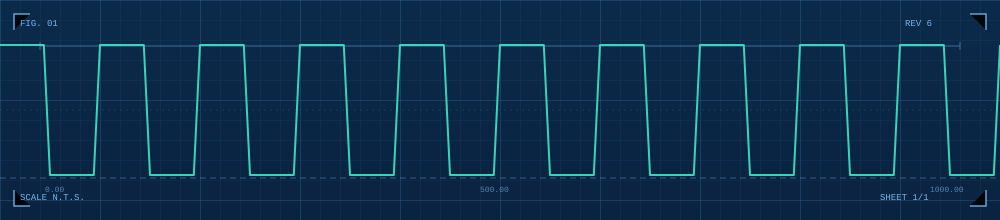

<div align="center">
  
</div>

<div align="center">


<br><br>


[](https://x.com/AtulAkella)
[](https://linkedin.com/in/atulakella)
[](https://heyatul.xyz)

</div>

<br>

```bash
atul@vitap:~$ cat /etc/motd
```

> Final-year ECE at VIT-AP University. I live at the hardware-software boundary —
> Linux drivers, BSP bring-up, and the IPC layer between real-time cores and
> Linux userspace. Most problems get interesting the moment you stop trusting
> the abstraction.

<br>

```bash
atul@vitap:~$ cat /proc/toolchain
```

<div align="center">


`Embedded Linux` `BSP Bring-up` `OpenAMP/RPMsg` `Kernel Modules` `PREEMPT_RT`
`ARM Cortex-A/M` `FreeRTOS` `Vitis HLS` `AXI4` `MAVLink` `TinyML`

</div>

<br>

```bash
atul@vitap:~$ ./scripts/fetch_links.sh
```

<div align="center">

[](https://heyatul.xyz)
[](https://linkedin.com/in/atulakella)
[](https://x.com/AtulAkella)
[](mailto:atul.akella@gmail.com)

</div>

<br>

<div align="center">


</div>

<div align="center">
<sub>⚡ currently characterizing IPC latency on the STM32MP157D · always down to talk rpmsg, remoteproc, or drone firmware</sub>
</div>
